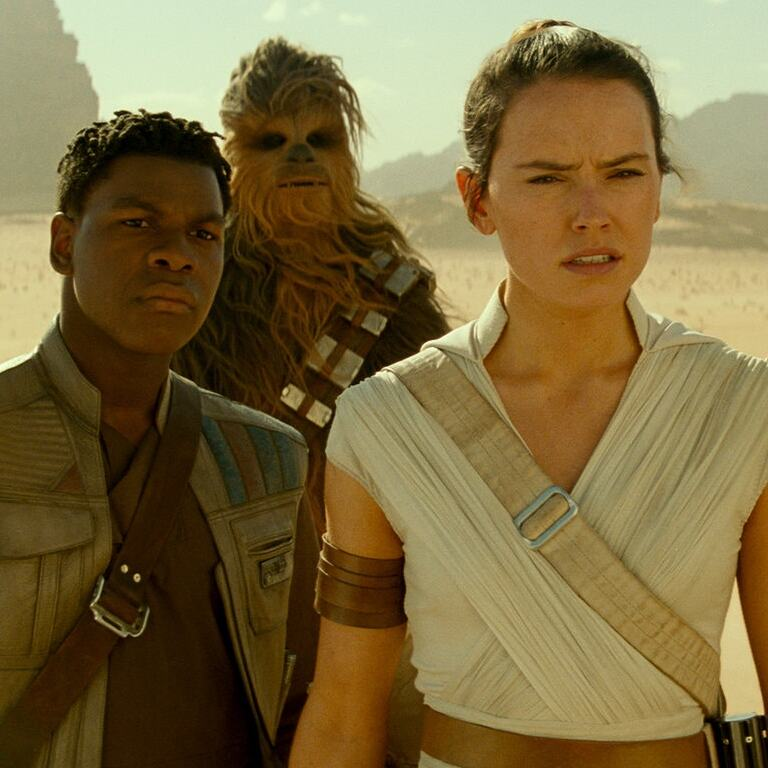
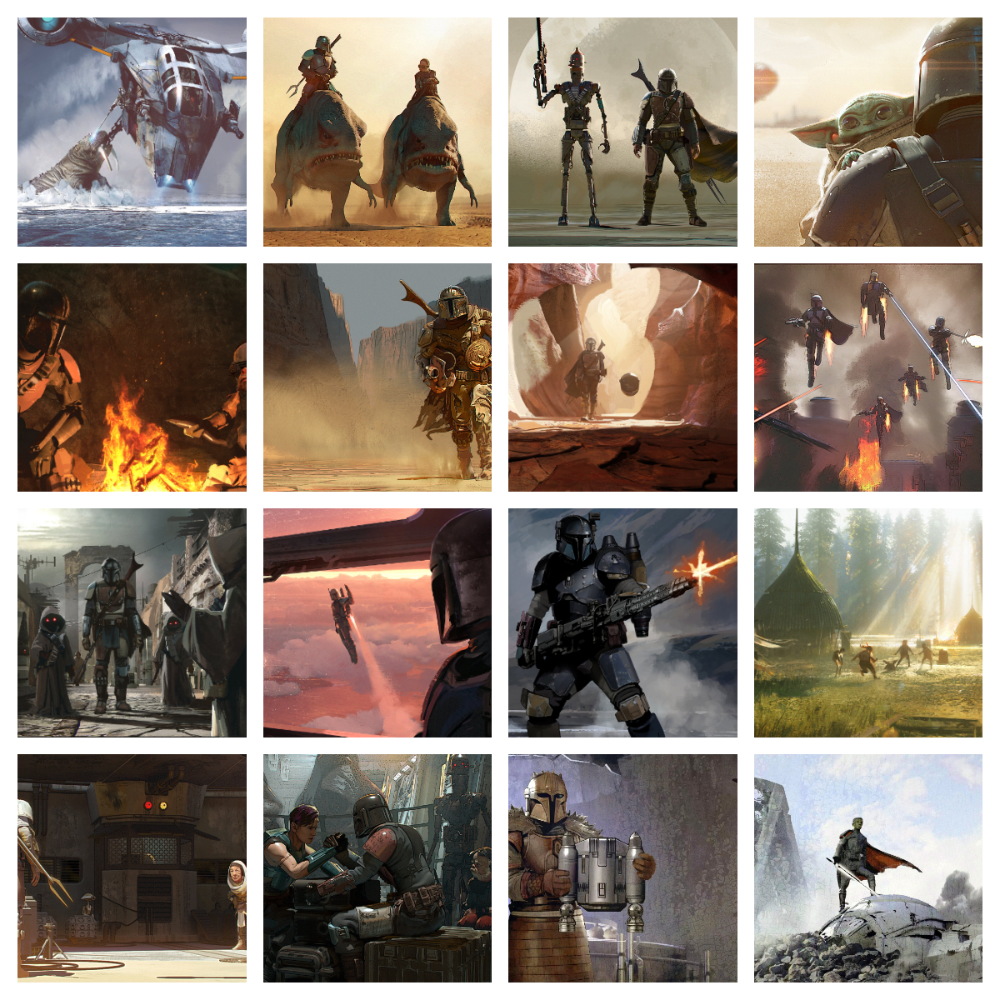
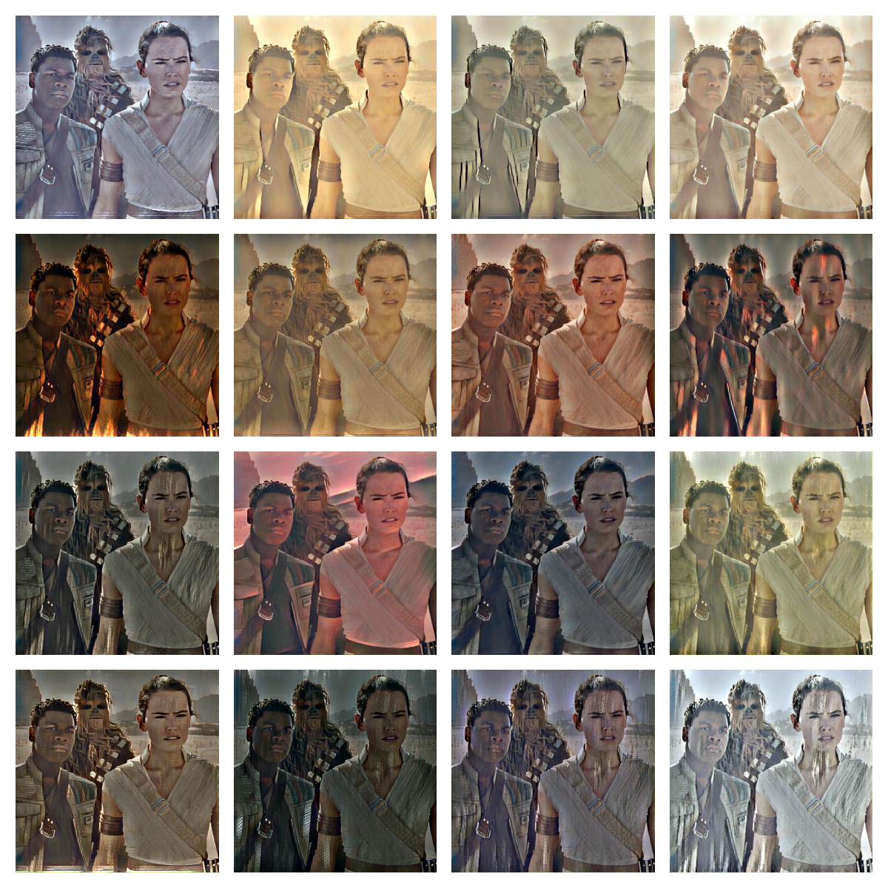
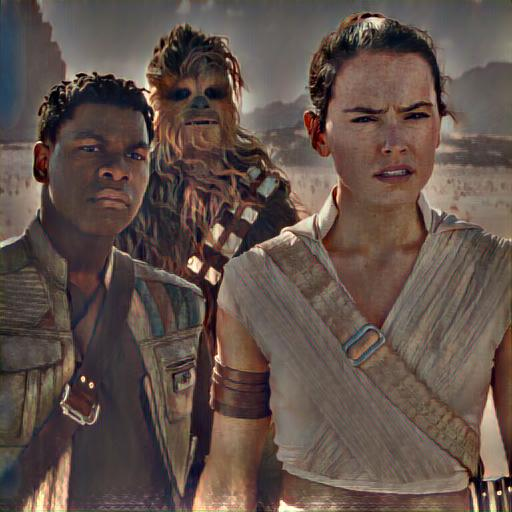
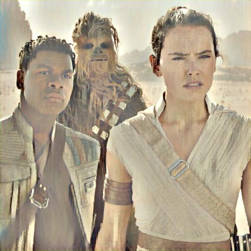

# Multi Style Transfer
PyTorch implementation of [A LEARNED REPRESENTATION FOR ARTISTIC STYLE](https://arxiv.org/pdf/1610.07629.pdf), Using [UNet](https://arxiv.org/pdf/1505.04597.pdf) as the image transform network. 
  
## The Mandalorian Concept Art Style Transfer

This model used for creating The Mandalorian concept art  
**Content Image**

  
**Style Images**

**Output**

**Style Combination**
|Styles 1 and 5 | Styles 2 and 16 |
|------|--------|
|   | |

## Style Transer Papers Used 
[A Neural Algorithm of Artistic Style](https://arxiv.org/pdf/1508.06576.pdf) (Leon A. Gatys, Alexander S. Ecker, Matthias Bethge)  
[Perceptual Losses for Real-Time Style Transfer and Super-Resolution](https://cs.stanford.edu/people/jcjohns/papers/eccv16/JohnsonECCV16.pdf) (Justin Johnson, Alexandre Alahi, and Li Fei-Fei)  
[Instance Normalization: The Missing Ingredient for Fast Stylization](https://arxiv.org/pdf/1607.08022.pdf) (Dmitry Ulyanov, Andrea Vedaldi, Victor Lempitsky)  
[A LEARNED REPRESENTATION FOR ARTISTIC STYLE](https://arxiv.org/pdf/1610.07629.pdf) (Vincent Dumoulin & Jonathon Shlens & Manjunath Kudlur)  

### TODO 
- [X] Re-implement Johnson et al work.
- [X] Add conditinal instance normalization.
- [X] Add UNet.
- [X] Use Mandalorian concept art as style.
- [ ] Use transfer learning on WikiArt for style image grouping, see [here](https://openaccess.thecvf.com/content_ECCV_2018/papers/Artsiom_Sanakoyeu_A_Style-aware_Content_ECCV_2018_paper.pdf).
- [ ] Add style weights.
- [ ] Add how to use.
